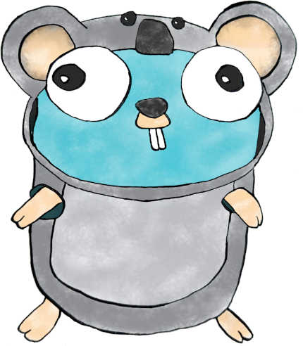

# Gophercon AU 2024 Hardware Hack Session

The is the repository for the hardware hack session at Gophercon AU 2024.

https://gophercon.com.au/

### If you received a Badger2040, it is yours to keep. Please return all other equipment when you are finished for the next person. Thank you!

## Installation

Please read our [installation instructions here](./INSTALL.md).

## Activities

### Badger2040-W Hacking

If you are one of the very fortunate individuals to have received a Badger2040 badge that is programmable using TinyGo, it is in fact yours to keep!

There are several different activities for you to use the Badger2040 to learn about programming devices.

Go to https://github.com/hybridgroup/badger2040 for more info.

### Parrot Minidrones

We have Parrot Minidrones you can fly with Go code to control them using their built-in Bluetooth API.

Post in-flight videos using hashtag #gopherconau

Ready for takeoff? Go to [./drone/minidrone/](./drone/minidrone/).

### WowWee MiP robots

Along for the ride, we brought a couple of WowWee MiP two-wheeled self-balancing robots that you control using Bluetooth.

Post robot videos using hashtag #gopherconau

Ready to roll? Go to https://github.com/hybridgroup/tinygo-mip.

### WowWee CHiP robot dog

We also brought our WowWee CHiP the robot dog that you control using Bluetooth.

This is a challenge activity: help us complete the implementation for the complete API.

Post robot videos using hashtag #gopherconau

Ready to do some new tricks? Go to https://github.com/hybridgroup/tinygo-chip.

> :info: take a look at the [./tools](./tools) directory for instructions on how to do bluetooth discovery

### TinyGo Open LED Race

Minimalist race game with an LED strip.

For more information, please go to https://github.com/conejoninja/ledrace

### TinyGo IoT sensors

Looking for the true "parts experience"? Got you covered! We have brought some Arduino Nano RP2040 Connect IoT microcontroller boards for each person to use for the activity.

https://store.arduino.cc/collections/boards/products/arduino-nano-rp2040-connect

These can be programmed using TinyGo.

There are some Grove sensor kits that you can use for the activity.

Ready to try this out? Go to [./sensor/arduino/](./sensor/arduino/) to get started.

## License

Copyright (c) 2015-2024 The Hybrid Group and friends. Licensed under the MIT license.
